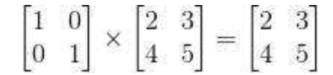
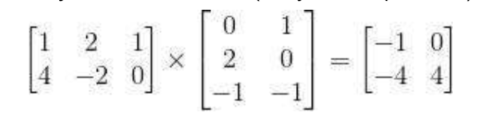
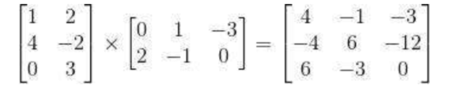

# MatrixMultiplication_SymbolicLanguages
This program implements Matrix multiplication using Python, tkinter, C/C++.
Done for the Symbolic Languages course.
## Description
-  Okno z przyciskiem "Uruchom obliczenia", polem z informacjami o ostatnim uruchomieniu (czas obliczeń w Pythonie, czas obliczen w C/C++, czas potrzebny na konwersję danych), oraz polami pozwalającymi wybrać:
    * Liczbę kolumn macierzy,
    * Liczbę wierszy macierzy,
    * Zakres generowanych wartości w macierzach (od, do),
    * Rodzaj generowanych wartości (liczby całkowite/rzeczywiste),
    * Liczba powtórzeń mnożenia (do uśrednienia czasu obliczeń).
- Powinna dodatkowo istnieć możliwość ręcznego wprowadzenia niewielkich (do trzech wierszy i kolumn) macierzy klóre mają być przemnożone. Wprowadzanie tych macierzy można zrealizować przez tablice pól tekstowych do wprowadzenia elementów macierzy.
- Po wciśnięciu przycisku "Uruchom obliczenia" generowane są dwie macierze o podanych przez użytkownika parametrach, które są następnie mnożone w Pythonie oraz w C/C++. (kod mnożący wywoływany z pliku .dll). Jeśli macierzy nie da się przamnożyć, ma zostać wyświetlony odpowiedni komunikat w oknie dialogowym (proszę ,urzyć mechanizmu wyjątków).
- Implementacje w Pythonie i w C lub C++ mają byc realizowane w dwóch klasach (MnozenieMacierzyCpp,MnozenieMacierzyPython) dziedziczących po klasie MozenieNacierzy z metodą mnoz.
- Zapisywany jest czas obuczeń w pierwszym i drugim języku oraz czas przygotowania danych do przestania do C/C++.
- Wyniki wpisywane są do pola z informacjami.
- Do wywolywania funkcji z dll należy stosować bibliotekę ctypes
    (https://docs.python.org/3.6/library/ctypes.html)
## Testy
1. Wykonanie mnożenia (w Pythonie i przez dll):
    
2. Wykonanie mnożenia (w Pythonie i przez dll):
    
3. Wykonanie mnożenia (w Pythonie i przez dll):
    
4. Próba wykonania mnożenia macierzy 2x3 przez macierz 1x2 (oczekiwany komunikat o błędzie i możliwość kontynuowania pracy z programem bez ponownego uruchamiania. 
5. Uzyskanie porównania czasów dla mnożenia macierzy 1x1, 10x10 i 50x50 (odpowiednio 100000, 1000 i 50 powtórzeń, liczby całkowite). 
6. Uzyskanie porównania czasów dla mnożenia macierzy 200x200 (3 powtórzenia, liczby rzeczywiste). 

